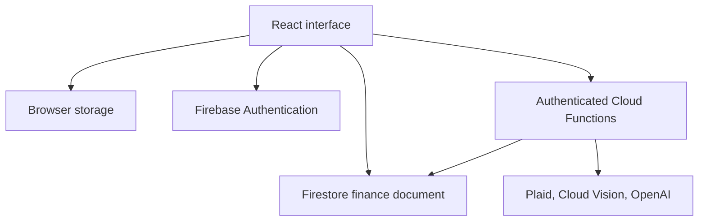

# ExpensePilot

A personal finance workspace for understanding spending, tracking savings goals, and keeping manual and imported transactions in one place. Built with React and Firebase, with optional Plaid bank connections, receipt OCR, and an AI finance assistant.

[Open the web app](https://sahilsbudget.netlify.app) · [Frontend](src) · [Cloud Functions](functions/index.js) · [Firestore rules](firestore.rules)

## What it does

- Track income and expenses with categories, dates, payment methods, receipt images, and editable transaction details.
- Explore monthly and yearly cash flow, spending charts, and account summaries.
- Allocate contributions to savings goals and identify recurring subscription candidates from transaction history.
- Use local browser storage without Firebase configuration, or sign in with Google or email and password to save data in Firestore.
- Connect accounts through Plaid Link and import transaction updates through authenticated Cloud Functions.
- Extract receipt text with Google Cloud Vision and ask an OpenAI powered assistant questions about a server generated finance summary.
- Install the web app as a PWA. The repository also contains Android and iOS projects through Capacitor and an Electron desktop wrapper.

## Engineering overview

The client handles the interface and local state. Firebase Authentication identifies cloud users, while Firestore stores each user's finance document. Privileged integrations run in Cloud Functions so Plaid access tokens and provider API keys stay outside the browser bundle.



| Area | Implementation |
| --- | --- |
| Interface | React 19, Vite, custom responsive components and CSS |
| Persistence | Local storage fallback; Firestore cloud saves and periodic refresh |
| Authentication | Firebase Google and email/password sign in |
| Bank integration | Plaid Link, public token exchange, transaction sync, and webhook handler |
| Receipt processing | Image compression in the client; Cloud Vision OCR and receipt parsing in Functions |
| Finance assistant | OpenAI `gpt-4.1-mini`, using a bounded summary of the signed in user's data |
| Packaging | Vite PWA, Capacitor Android/iOS scaffolding, Electron Windows packaging configuration |

The bank merge logic preserves transactions marked as manually edited. Subscription detection is a heuristic over transaction history. Bank account balances in the interface are not a live balances integration.

## Run locally

Use Node.js 22 LTS and npm for the web project.

```bash
git clone https://github.com/Sahil-Arifi/finance_tracker.git
cd finance_tracker
npm ci
npm run dev
```

Open the local URL printed by Vite, normally `http://localhost:5173`. With no Firebase configuration, the app uses browser storage and shows a setup notice. Authentication, bank imports, OCR, and the cloud assistant require the services below.

### Enable Firebase

1. Create your own Firebase project and register a web app.
2. Enable the Google and/or email/password sign in providers. Add `localhost` and your deployed hostname to Authentication's authorized domains.
3. Copy `.env.example` to `.env` and fill in the `VITE_FIREBASE_*` values from your Firebase web app configuration.
4. Create Firestore and review [firestore.rules](firestore.rules). The rules restrict finance documents to their owner and deny client access to Plaid token and lookup collections.
5. Associate the Firebase CLI with your project before deploying rules or functions.

```bash
cp .env.example .env
npx firebase login
npx firebase use --add
npm run deploy:rules
```

Firebase's web configuration belongs in the frontend environment. **Never put Plaid secrets, OpenAI keys, or service account credentials in a `VITE_*` variable.** Vite embeds those variables in the browser bundle.

### Optional server integrations

The Functions project declares Node.js 20 as its deployment runtime.

```bash
cd functions
npm ci
cp .env.example .env
```

Configure the server environment for your own Firebase project:

| Setting | Purpose |
| --- | --- |
| `PLAID_CLIENT_ID`, `PLAID_SECRET` | Plaid credentials for Link and transaction synchronization |
| `PLAID_ENV` | Defaults to `sandbox`; use test accounts while developing |
| `OPENAI_API_KEY` | Required for the finance assistant; `OPENAI_KEY` is also accepted by the current implementation |
| Cloud Vision API | Enable the API and billing in the Firebase project's Google Cloud project for receipt OCR |
| `VITE_FUNCTIONS_REGION` | Frontend callable region; defaults to `us-central1` |

Keep server credentials out of source control. The example environment file contains placeholders only. Deploy Functions deliberately to your own project using `npm run deploy:functions` from the repository root. Configure the Plaid webhook URL for the deployed `plaidWebhook` endpoint when testing background updates.

Optional App Check configuration is described in [.env.example](.env.example). Its client configuration must match the enforcement settings in your Firebase project.

## Build and platform commands

| Command | Purpose |
| --- | --- |
| `npm run build` | Create the web build in `dist/` |
| `npm run preview` | Preview the built web app |
| `npm run lint` | Run the repository's ESLint configuration |
| `npm run cap:build` | Build the web app and sync assets into the native projects |
| `npm run electron:dev` | Build and launch the Electron wrapper |
| `npm run electron:build` | Build the configured Windows desktop package |

Android and iOS development require their native toolchains. The platform folders and packaging scripts do not imply an App Store, Play Store, or signed desktop release.

[netlify.toml](netlify.toml) builds and serves the web application with an SPA fallback. Set frontend environment variables on the host **before** building. Hosting the frontend does not deploy Firebase rules or Functions.

## Source map

- [src/App.jsx](src/App.jsx): screens, finance state, cloud persistence, and bank synchronization.
- [src/components/](src/components): transaction forms, charts, goals, accounts, and chat.
- [src/utils/](src/utils): transaction merging, subscription inference, dates, and local insights.
- [src/services/cloudFunctions.js](src/services/cloudFunctions.js): authenticated callable clients.
- [functions/index.js](functions/index.js): OCR, Plaid, and finance assistant endpoints.
- [functions/services/openaiClient.js](functions/services/openaiClient.js): model configuration and response generation.
- [functions/receiptParse.js](functions/receiptParse.js): receipt text parsing.

## Current status

ExpensePilot is an actively developed portfolio application. The repository contains the integrations described above; their live availability depends on deployment configuration and provider accounts.

The current default branch does not have an automated test suite. Priorities include verifying Plaid webhook signatures, applying removed transactions during sync, and persisting imported data before advancing its cursor. The finance document currently stores transaction arrays, which limits scalability and requires more work on concurrent updates. AI answers and receipt extraction can be incomplete or incorrect and should be checked against the source records.
